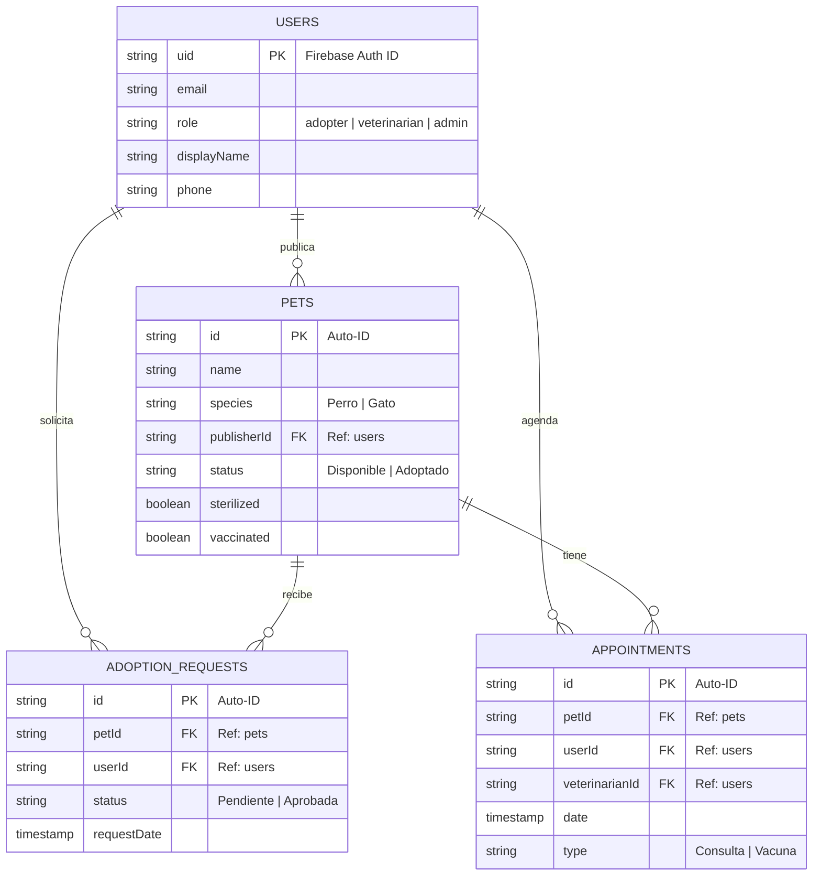

# Diagrama Visual de Base de Datos (Firestore)

Este diagrama representa las colecciones y sus referencias lógicas.

> **Nota:** En Firestore (NoSQL), las relaciones (líneas) son lógicas. No existen "Foreign Keys" estrictas como en SQL, pero este diagrama muestra cómo se conectan los datos a través de los IDs.
